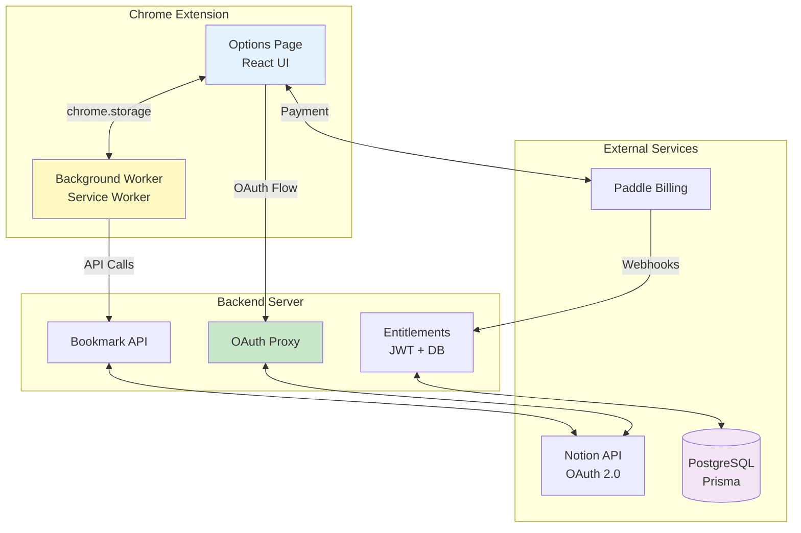

# Bookmark Assistant

> **AI-powered Chrome extension for intelligent bookmark management and seamless Notion synchronization**

[](https://www.typescriptlang.org/)
[](https://reactjs.org/)
[](https://nextjs.org/)

Bookmark Assistant is a professional-grade Chrome extension that transforms how you organize and sync bookmarks. Built with modern web technologies, it offers intelligent content extraction, secure OAuth authentication, and a flexible freemium model with Pro features for power users.

---

## 🎯 Product Overview

### **What It Does**

Bookmark Assistant bridges the gap between your Chrome bookmarks and Notion workspace, providing:

- **One-click synchronization** of bookmarks to Notion databases
- **Smart content extraction** from bookmarked pages (title, description, metadata)
- **Automatic background sync** with configurable intervals (Pro feature)
- **Fingerprint-based change detection** to avoid redundant syncs
- **Freemium model** with usage limits and Pro upgrade path

### **Who It's For**

- **Knowledge workers** managing research and references
- **Content creators** organizing inspiration and resources
- **Developers** bookmarking documentation and tutorials
- **Students** collecting academic materials
- **Power users** wanting advanced automation and AI features (coming soon)

---

## ✨ Core Features

### **Free Tier**

| Feature               | Specification                         |
| --------------------- | ------------------------------------- |
| **OAuth Integration** | Secure Notion workspace connection    |
| **Manual Sync**       | One-click bulk export to Notion       |
| **Auto-Sync**         | Disabled (Pro only)                   |
| **Sync Interval**     | Minimum 24 hours (if enabled)         |
| **Database Mapping**  | Single Notion database per connection |

### **Pro Tier** ($2.99/month or $29.99 lifetime)

| Feature              | Specification                                    |
| -------------------- | ------------------------------------------------ |
| **Auto-Sync**        | Background synchronization every 6+ hours        |
| **Faster Sync**      | Minimum 6-hour interval (vs 24h free)            |
| **Priority Support** | Faster response times                            |
| **Coming Q1 2025**   | AI tagging, summaries, multi-database (included) |

> 🎁 **Early Bird Pricing**: Lock in $2.99/month or get lifetime access for $29.99 before AI features launch

---

## 🚀 Advanced Features (Roadmap)

### **Q1 2025 - Launch & Intelligence** 🚀

- [ ] **Bookmark Favicon Support**: Display site icons in Notion for better visual recognition
- [ ] **AI-Powered Tagging**: Automatic category and topic detection using OpenAI
- [ ] **Smart Summaries**: AI-generated content summaries for quick review
- [ ] **Chrome Web Store Launch**: Public release and user acquisition

### **Q2 2025 - Organization & Efficiency** 📁

- [ ] **Folder Mapping**: Sync Chrome folders to corresponding Notion databases
- [ ] **Multi-Database Support**: Route bookmarks to different Notion databases by rules
- [ ] **Bulk Operations**: Edit, delete, or move multiple bookmarks at once
- [ ] **Enhanced Search**: Full-text search across bookmark content

### **Q3 2025 - Intelligence & Insights** 🔮

- [ ] **Custom Tag Templates**: User-defined tagging rules and patterns
- [ ] **Duplicate Detection**: Identify and merge similar bookmarks with AI
- [ ] **Export/Import**: Backup and restore bookmark collections
- [ ] **Analytics Dashboard**: Track sync frequency, bookmark growth, tag distribution

### **Q4 2025 - Expansion & Enterprise** 🌍

- [ ] **Cross-Browser Support**: Firefox and Safari extension ports
- [ ] **Team Collaboration**: Shared workspaces and permissions
- [ ] **Enterprise Tier**: SSO, admin controls, audit logs
- [ ] **Mobile Companion**: iOS/Android apps for on-the-go access

---

## 🏗️ Product Structure

### **Monorepo Architecture**

```
bookmark-notion-sync/
├── packages/
│   ├── extension/       # Chrome MV3 extension (client)
│   ├── server/          # OAuth & API server (backend)
│   ├── website/         # Marketing landing page
│   └── shared/          # Shared design tokens & utilities
├── scripts/             # Build and development automation
└── tests/              # E2E, integration, and unit tests
```

---

## 🛠️ Technical Architecture

### **System Architecture**



### **Key Technical Decisions**

#### **1. Event-Driven State Management**

- **Pattern**: `chrome.storage.onChanged` listeners instead of polling
- **Why**: MV3 service workers are ephemeral; storage is the source of truth
- **Implementation**: Options UI listens to `session_token`, `last_sync`, `sync_in_progress` keys

#### **2. Sync Fingerprinting**

- **Mechanism**: SHA-256 hash of bookmark titles/URLs to detect changes
- **Benefit**: Avoids redundant syncs when no bookmarks have changed
- **UX**: Minimal spinner duration (1.2s) to prevent flicker on "no changes" syncs

#### **3. Secure OAuth Flow**

- **Client Secret**: Never exposed to extension; stored server-side only
- **Token Exchange**: Extension gets auth code via Chrome Identity API → sends to server → receives JWT
- **API Calls**: Extension includes JWT in headers; server validates and proxies to Notion

#### **4. Rate Limiting & Entitlements**

- **Free Tier**: 24-hour min interval, auto-sync disabled
- **Pro Tier**: Unlimited manual syncs, 6-hour min interval for auto-sync
- **Enforcement**: Server checks entitlements before processing sync requests
- **Payment**: Paddle integration for Pro subscriptions ($5/month)

#### **5. Content Extraction Pipeline**

```typescript
// Extraction priority:
1. Active tab injection (if URL matches)
2. Find tab by URL → inject script
3. Fallback: URL metadata (hostname, path)

// Extracted fields:
- Title (meta og:title > <title> > <h1>)
- Description (meta description > og:description)
- Keywords (meta keywords)
- Content (main > article > body, max 5000 chars)
```

---

## 🚀 Quick Start

### **For Users**

#### **1. Install the Extension**

1. Download the extension from Chrome Web Store _(coming soon)_ or load unpacked from `packages/extension/dist`
2. Click "Add to Chrome" and grant requested permissions

#### **2. Connect to Notion**

1. Click the extension icon in Chrome toolbar
2. Navigate to **Settings** (Options page)
3. Click **Connect to Notion**
4. Complete OAuth authentication in the popup
5. Grant access to your Notion workspace

#### **3. Configure Database**

1. In Notion, create a database with these properties:
   - `Title` (Title) — Bookmark title
   - `URL` (URL) — Bookmark URL
   - `Description` (Text) — Page description
   - `Created` (Date) — Bookmark creation timestamp
   - `BookmarkId` (Text) — Unique identifier
   - `Source` (Text) — Default: "Chrome Bookmarks"
2. Copy the database ID from the Notion URL:
   ```
   https://notion.so/workspace/{database_id}?v=...
                              ^^^^^^^^^^^
   ```
3. Paste the database ID in extension settings

#### **4. Sync Bookmarks**

1. Click **Sync All Bookmarks** in the extension popup
2. Monitor progress in the UI (processes 5 bookmarks at a time)
3. Check your Notion database to see imported bookmarks

---

## 📚 Documentation

### **User Guides**

- [Getting Started Guide](docs/getting-started.md) — Installation and setup walkthrough
- [Database Setup Guide](docs/database-setup.md) — Notion database configuration
- [Sync Settings Guide](docs/sync-settings.md) — Auto-sync and interval configuration

### **Developer Guides**

- [Technical Specification](docs/spec/PAYMENT.md) — Payment and user system
- [Paddle Integration](docs/spec/PADDLE_INTEGRATION.md) — Payment setup and configuration
- [Auto-Sync Implementation](docs/spec/AUTO_SYNC.md) — Auto-sync feature details
- [State Management](docs/STATE_MANAGEMENT.md) — Extension state architecture
- [Testing Guide](tests/README.md) — Testing infrastructure and examples
- [Paddle Testing Checklist](docs/TESTING_CHECKLIST.md) — Payment integration testing
- [Quick Start Auth](QUICK_START_AUTH.md) — OAuth and upgrade flow testing

---

## 🌟 Features Roadmap

### Core Features ✅

- [x] Bulk bookmark sync
- [x] OAuth authentication
- [x] Content extraction
- [x] Error handling

### Advanced Features 🔮

- [ ] AI-powered tagging (OpenAI integration)
- [ ] AI-generated summaries
- [ ] Custom tag templates
- [ ] Folder-based syncing
- [ ] Bulk edit operations
- [ ] Export/import bookmarks
- [ ] Multiple Notion databases
- [ ] Browser bookmark folders mapping

---

## 📄 License

**Proprietary Software** — All rights reserved.

This is a commercial project. The source code is not open source and may not be copied, modified, or distributed without explicit permission.

---

## 🗺️ Development Roadmap

### **Q4 2024** ✅

- [x] Core sync functionality
- [x] OAuth integration
- [x] Content extraction
- [x] Freemium model with Pro tier
- [x] Paddle payment integration
- [x] Auto-sync with catch-up strategy
- [x] Comprehensive test infrastructure

### **Q1 2025** 🚀

- [ ] **Chrome Web Store listing** (Public launch)
- [ ] **Bookmark Favicon support** (Visual recognition)
- [ ] **AI-powered tagging** (OpenAI integration)
- [ ] **Smart summaries** (AI-generated content summaries)
- [ ] User onboarding improvements
- [ ] Performance optimization

### **Q2 2025**

- [ ] **Folder-to-database mapping** (Chrome folders → Notion DBs)
- [ ] **Multi-database support** (Route bookmarks by rules)
- [ ] **Bulk operations UI** (Edit/delete/move multiple bookmarks)
- [ ] Enhanced error handling
- [ ] Analytics dashboard (basic)

### **Q3 2025**

- [ ] **Custom tag templates** (User-defined tagging rules)
- [ ] **Duplicate detection** (Smart merge suggestions)
- [ ] **Export/import bookmarks** (Data portability)
- [ ] Search enhancement (Full-text search)
- [ ] Mobile companion app (iOS/Android) - Research phase

### **Q4 2025**

- [ ] Firefox extension port
- [ ] Safari extension port
- [ ] Team collaboration features (Shared workspaces)
- [ ] Enterprise tier (SSO, admin controls)
- [ ] Advanced analytics (Content insights)

---

## 📊 Project Status

| Metric               | Status                 |
| -------------------- | ---------------------- |
| **Development**      | Active 🟢              |
| **Version**          | 0.1.0 (Beta)           |
| **License**          | Proprietary            |
| **Chrome Web Store** | Pending Review         |
| **Active Users**     | Private Beta           |
| **Test Coverage**    | 27% (13 passing tests) |
| **Last Updated**     | 2025-12-19             |
