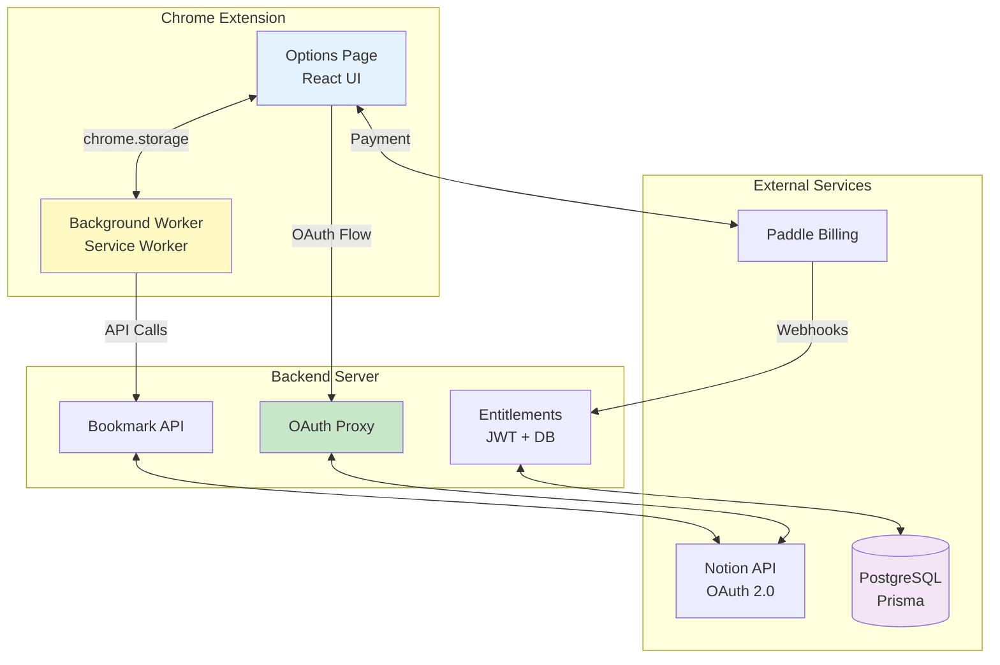

# Bookmark Assistant

> **Chrome extension for seamless bookmark synchronization with Notion**

[](https://www.typescriptlang.org/)
[](https://www.primereact.org/)
[-green>)](tests/)
[](packages/extension/)

Bookmark Assistant transforms Chrome bookmarks and Reading List items into an organized Notion database with automatic description extraction, change detection, and background synchronization.

---

## Open Source Model

Bookmark Assistant is open source under AGPL-3.0-or-later.

The source code can be used to self-host the extension and server with your own Notion integration and database. The official hosted service remains a paid cloud product for Pro features such as higher hosted limits, automatic sync, priority processing, and managed billing.

The code is open source; the official Bookmark Assistant name, logo, Chrome Web Store listing, domains, and hosted service branding are reserved. See [TRADEMARKS.md](TRADEMARKS.md).

---

## 🏗️ System Architecture

### **Monorepo Structure**

```
bookmark-assistant/
├── packages/
│   ├── extension/       # Chrome MV3 extension (React + TypeScript)
│   ├── server/          # OAuth & API backend (Express + TypeScript)
│   ├── website/         # Marketing landing page (Next.js)
│   └── shared/          # Shared utilities
└── tests/               # Unit & integration tests
```

### **Architecture Overview**



---

## 🎯 System Specifications

### **Core Functionality**

- **Bookmark Sync**: Chrome bookmarks and Reading List items → Notion database
- **Metadata Extraction**: Titles, descriptions, URLs, timestamps
- **Change Detection**: SHA-256 fingerprinting to avoid redundant syncs
- **Quick Save**: Save the current tab or a right-clicked link directly to Notion
- **Auto-Sync**: Background synchronization (Pro feature)
- **OAuth Security**: Secure authentication with Notion

### **Plan Differences**

These differences apply to the official hosted service. Self-hosted deployments can enable local Pro-level defaults with `SELF_HOSTED=true`.

| Plan | Bookmarks/Sync | Auto-Sync | Sync Interval |
| ---- | -------------- | --------- | ------------- |
| Free | Unlimited      | No        | Manual        |
| Pro  | Unlimited      | Yes       | 6+ hours      |

---

## 🛠️ Technical Design

### **1. State Management Architecture**

**Pattern**: Event-driven state management using `chrome.storage.onChanged`

**Rationale**: MV3 service workers are ephemeral; Chrome storage acts as the source of truth

**Implementation**:

- Background script: Single source of truth, writes all state to `chrome.storage.local`
- Options UI: Subscribes via `chrome.storage.onChanged` listeners
- State keys: `session_token`, `last_sync`, `sync_in_progress`, `is_pro`

### **2. Sync Optimization**

**Fingerprinting**: SHA-256 hash of bookmark and Reading List titles/URLs

**Benefits**:

- Detects bookmark changes without full comparison
- Avoids redundant API calls
- Minimal UI flicker (1.2s max spinner duration)

**Change Detection Flow**:

1. Generate fingerprint of current bookmarks and Reading List items
2. Compare with last sync fingerprint
3. If changed: proceed with sync
4. If unchanged: show "up to date" message

### **3. Security Architecture**

**OAuth Flow**:

```
Chrome Identity API → Notion OAuth → Auth Code
Extension → Server (auth code) → JWT Token
JWT → API Requests → Server Validates → Proxies to Notion
```

**Security Measures**:

- Client secret: Never exposed to extension (server-side only)
- JWT tokens: Short-lived with expiration
- HTTPS: All traffic encrypted
- Minimal permissions: Read-only bookmarks and Reading List access, local storage, OAuth identity, alarms, and context menus

### **4. Content Extraction Pipeline**

**Extraction Strategy**:

1. Server-side metadata fetching (90-92% accuracy)
2. Fallback to URL-based heuristics
3. Caching for 30-day TTL

**Extracted Fields**:

- Title: `og:title` → `<title>` → `<h1>`
- Description: `description` → `og:description`
- Keywords: `keywords` meta tag
- Content: `main` → `article` → `body` (max 5000 chars)

### **5. Rate Limiting & Entitlements**

**Free Tier**:

- Unlimited bookmarks per sync
- Manual sync only
- 24-hour minimum interval

**Pro Tier**:

- Unlimited bookmarks per sync
- Auto-sync enabled (6+ hour interval)
- Priority processing

**Enforcement**: Server validates entitlements before processing sync requests

### **6. Database Schema**

**User Management**:

- `id` (CUID, primary key)
- `email` (unique)
- Notion OAuth tokens and workspace/database IDs
- Paddle customer/subscription IDs
- `plan` and `purchaseType`

**Bookmark Storage**:

- Bookmark records live in the user's Notion database, not in the app database.
- The server stores a `DescriptionCache` table for extracted URL descriptions.
- Duplicate detection uses Notion URL and Sync ID queries during each sync.

---

## 📁 Documentation Structure

### **Architecture Documentation** (`/docs/`)

- **[State Management](docs/STATE_MANAGEMENT.md)** — Extension state architecture
- **[Notion Integration](docs/NOTION_INTEGRATION.md)** — Notion API integration
- **[Auto-Sync](docs/AUTO_SYNC.md)** — Background synchronization design
- **[Paddle Integration](docs/PADDLE_INTEGRATION.md)** — Payment processing
- **[Description Cache](docs/DESCRIPTION_CACHE.md)** — Caching strategy
- **[Internationalization](docs/INTERNATIONALIZATION.md)** — Multi-language architecture

### **Open Source and Operations**

- **[Self-Hosting](SELF_HOSTING.md)** — Run your own extension and server
- **[Contributing](CONTRIBUTING.md)** — Development and PR guidelines
- **[Security](SECURITY.md)** — Vulnerability reporting and secret handling
- **[Support](SUPPORT.md)** — Community and official cloud support scope
- **[Trademarks](TRADEMARKS.md)** — Brand usage rules

### **Development**

- **[Documentation Index](docs/README.md)** - Public technical docs
- **[Contributing](CONTRIBUTING.md)** - Development workflow and PR guidelines
- **[Self-Hosting](SELF_HOSTING.md)** - Local and self-hosted setup
- **[Security](SECURITY.md)** - Vulnerability reporting and secret handling

---

## 🔧 Technology Stack

### **Extension**

- Chrome Extension API (MV3)
- React 18 + TypeScript
- Vite (build tool)
- Zustand (state management)
- Tailwind CSS (styling)

### **Server**

- Node.js 20+
- Express + TypeScript
- Prisma ORM
- PostgreSQL
- JWT authentication
- Notion SDK
- Paddle SDK

### **Website**

- Next.js 14
- TypeScript
- Tailwind CSS

---

## 📊 Project Status

| Metric            | Status              |
| ----------------- | ------------------- |
| **Development**   | ✅ Production Ready |
| **Version**       | 1.0.19              |
| **Test Coverage** | 82% (185 tests)     |

---

## 📄 License

Bookmark Assistant is licensed under the **GNU Affero General Public License v3.0 or later**.

See [LICENSE](LICENSE).

The open source license covers the source code. Product names, logos, hosted service branding, and Chrome Web Store listing assets are not licensed for reuse as trademarks.
