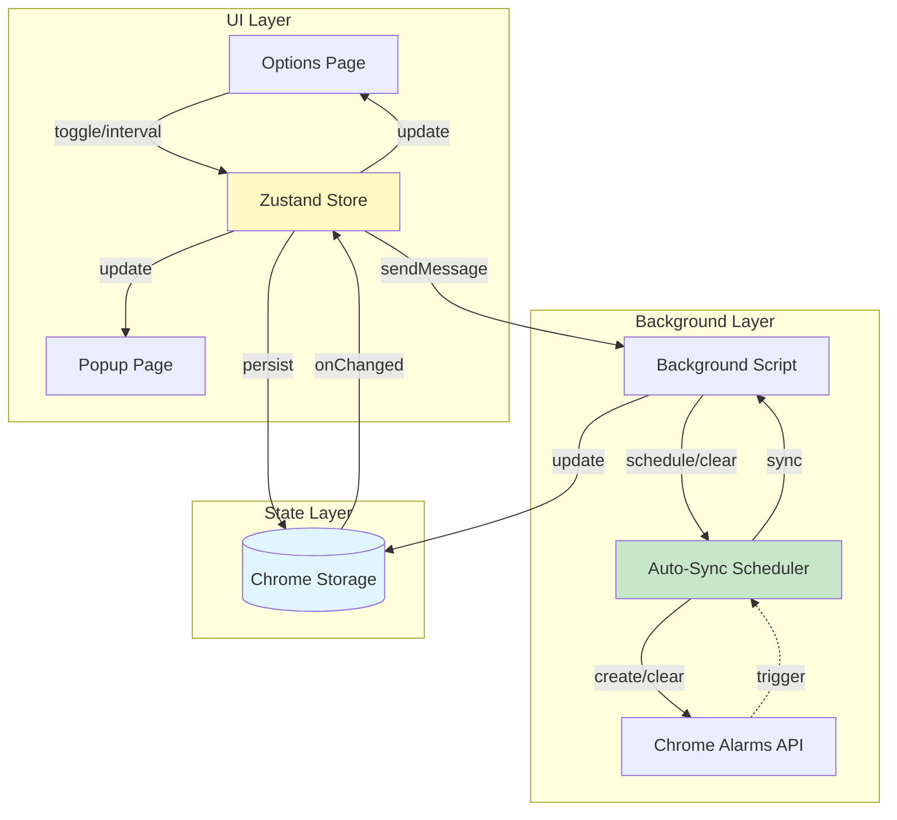
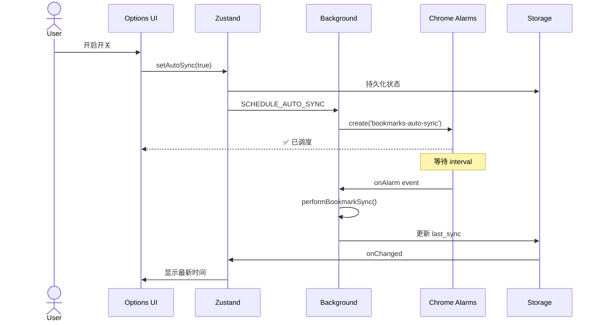

# Auto-Sync Feature

> **自动同步功能 - 定期将书签同步到 Notion**

## 📐 设计原则

1. **Pro 专属功能** - 仅 Pro 用户可启用
2. **灵活调度** - 最小间隔 6 小时（Pro）/ 24 小时（Free）
3. **智能追赶** - 浏览器重启后自动补偿错过的同步
4. **并发保护** - 防止手动同步和自动同步冲突

---

## 🏗 架构设计

### 系统架构



---

## 🔄 核心机制

### 1. 调度机制

**Chrome Alarms API**

- 基于系统级定时器，不受页面关闭影响
- 周期性触发（`periodInMinutes`）
- 首次延迟可配置（`delayInMinutes`）

**调度流程**:

```
用户启用 → 创建 Alarm → 定期触发 → 执行同步 → 更新时间戳
```

### 2. 状态管理

**Storage 键设计** (单一数据源):

| 键名                         | 类型       | 用途         | 说明                       |
| ---------------------------- | ---------- | ------------ | -------------------------- |
| `auto_sync_enabled`          | boolean    | 自动同步开关 | 主要状态（Alarm 系统使用） |
| `auto_sync_interval_minutes` | number     | 同步间隔     | 精确的分钟数               |
| `sync_interval_hours`        | number     | UI 友好间隔  | 可选缓存（小时）           |
| `last_sync`                  | ISO string | 上次同步时间 | 用于追赶策略               |

> **注意**: 之前的 `auto_sync` 键已废弃，统一使用 `auto_sync_enabled` 作为单一数据源，避免状态不一致。

**为什么保留两个间隔键?**

- `auto_sync_interval_minutes`: Alarm API 需要精确的分钟数
- `sync_interval_hours`: UI 显示用户友好的小时数
- 通过 storage listener 自动同步两者

### 3. 追赶策略

**浏览器重启场景**:

```typescript
启动时检查 last_sync 时间戳
  ↓
计算已过时间 elapsed
  ↓
if elapsed >= interval:
  立即执行补偿同步
  下次同步安排在 interval 后
else:
  安排剩余时间后同步
```

**收益**:

- 不会错过同步窗口
- 保持用户期望的频率
- 最小化启动延迟

### 4. 冲突避免

**并发检查**:

```typescript
Alarm 触发前检查:
  ✓ auto_sync_enabled === true
  ✓ sync_in_progress === false
  ✓ Service Worker 活跃
```

**场景处理**:

- 手动同步进行中 → 跳过自动同步
- 自动同步失败 → 不禁用 Alarm，下次重试
- 达到限额 → 记录状态，下次继续尝试

---

## 🎯 用户流程

### 启用 Auto-Sync



### 调整间隔

```
修改输入 → blur 事件 → saveSyncSettings() → 重新调度 Alarm
```

### 禁用 Auto-Sync

```
关闭开关 → setAutoSync(false) → clear Alarm → 停止自动同步
```

---

## 🔧 技术要点

### Alarm API 参数

```typescript
chrome.alarms.create('bookmarks-auto-sync', {
  periodInMinutes: 360, // 6 小时周期
  delayInMinutes: 360, // 首次延迟
});
```

### 权限限制

| 用户类型 | 最小间隔 | 开关状态            |
| -------- | -------- | ------------------- |
| Free     | 24 小时  | 禁用（UI disabled） |
| Pro      | 6 小时   | 可用                |

### 错误处理

- **429 Rate Limit**: 记录状态，继续 Alarm
- **网络错误**: 日志记录，下次重试
- **同步失败**: 不禁用 Alarm

---

## ✅ 测试检查

### 功能验证

- [ ] Pro 用户可启用，Free 用户不可
- [ ] 修改间隔后 Alarm 正确重新调度
- [ ] 浏览器重启后恢复 Alarm
- [ ] 过期时执行追赶同步
- [ ] 同步中不会重复触发
- [ ] 禁用后 Alarm 被清除

### 调试命令

**查看 Alarm 状态**:

```javascript
chrome.alarms.getAll(console.log);
```

**查看 Storage 状态**:

```javascript
chrome.storage.local.get(null, console.log);
```

**手动触发测试**:

```javascript
chrome.alarms.create('bookmarks-auto-sync', { delayInMinutes: 0.1 });
```

---

## 🔗 相关文档

- [State Management Architecture](../STATE_MANAGEMENT.md) - 全局状态管理设计
- [Chrome Alarms API](https://developer.chrome.com/docs/extensions/reference/alarms/)
- [Chrome Storage API](https://developer.chrome.com/docs/extensions/reference/storage/)
