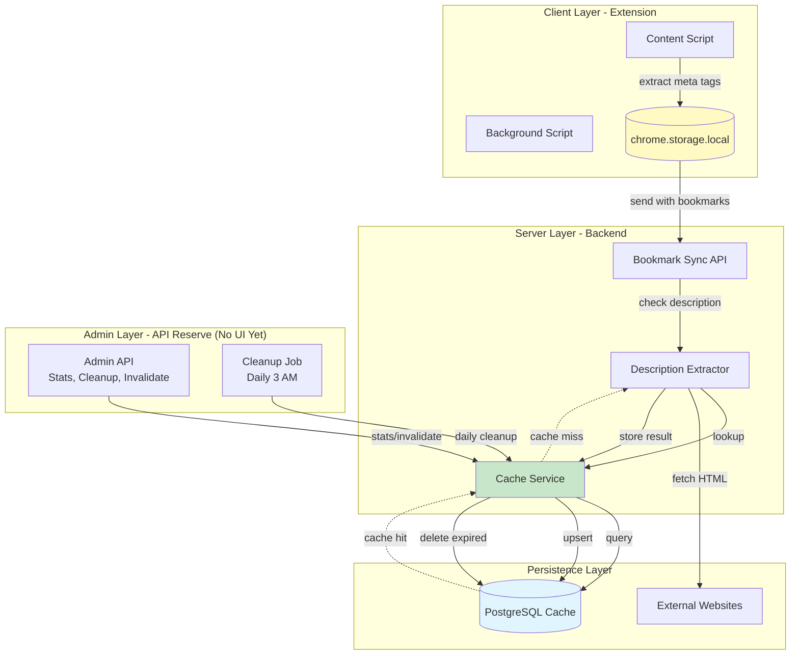
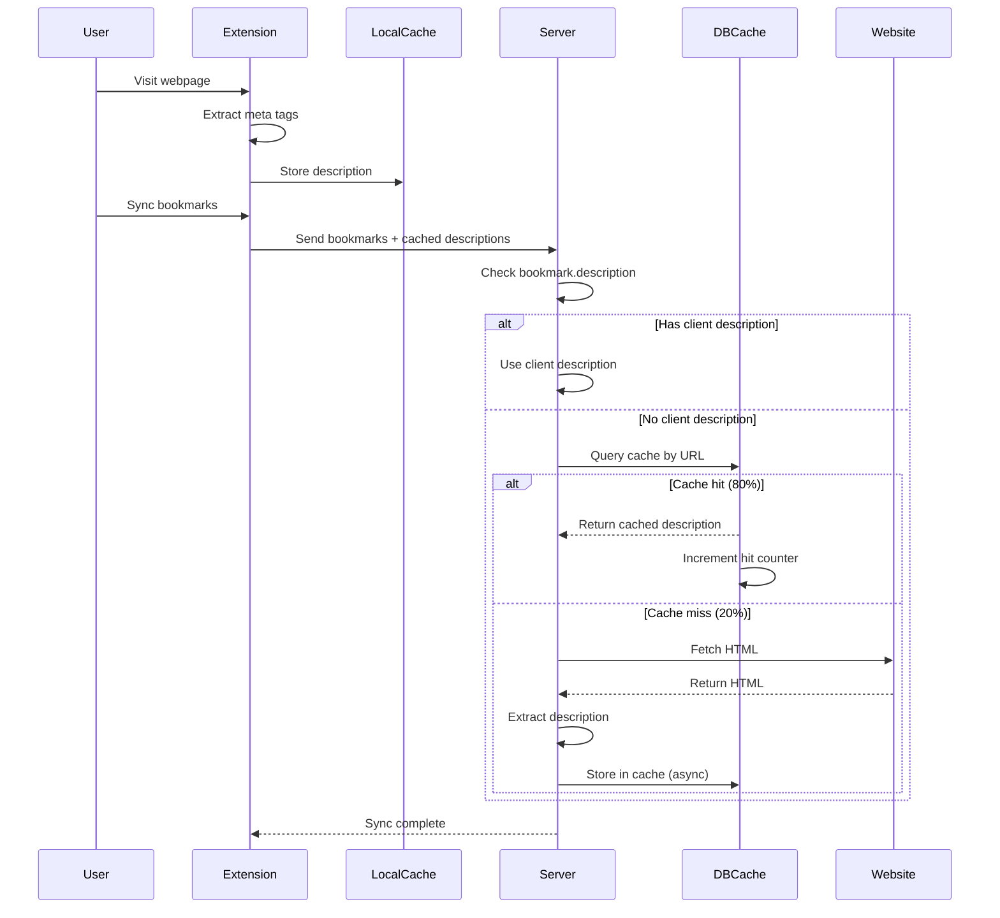
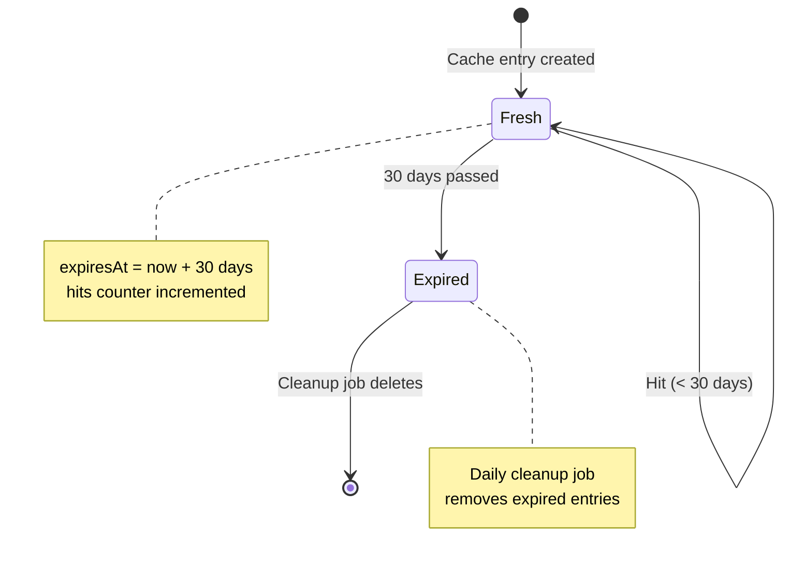
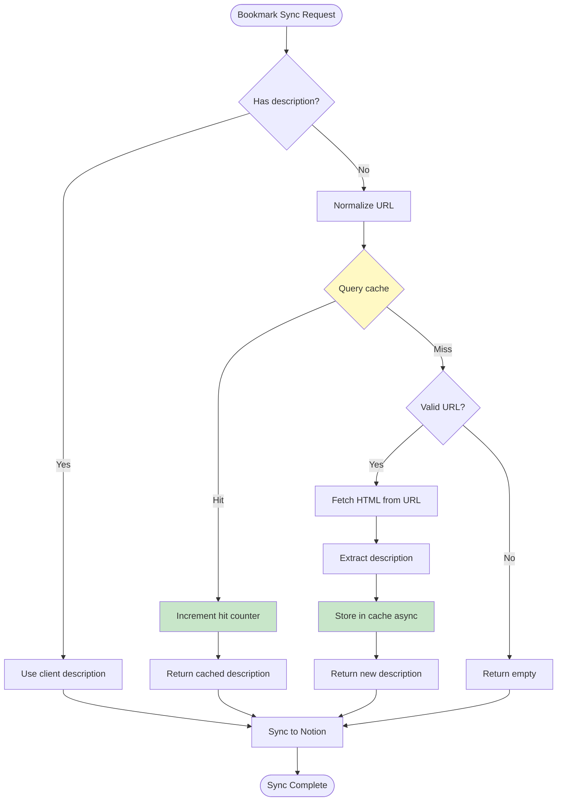
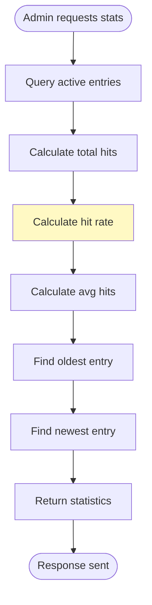
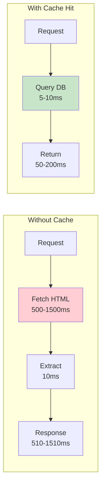
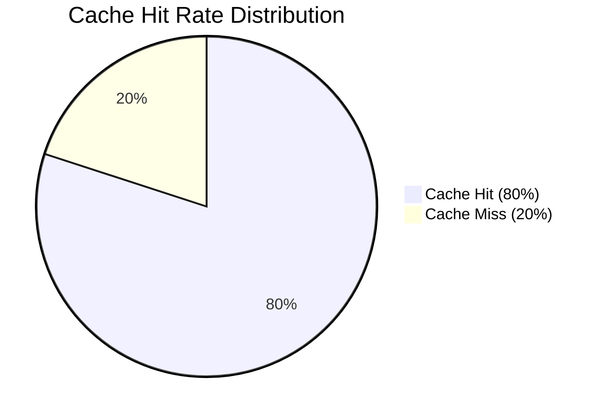

# Description Cache Feature

> **描述缓存功能 - 智能缓存书签描述，降低成本并提升性能**

## 📐 设计原则

1. **成本优化** - 减少 80% 的 HTTP 请求和服务器成本
2. **性能优先** - 缓存命中响应时间 < 200ms（vs 500-1500ms）
3. **智能过期** - 30 天 TTL，自动清理过期条目
4. **数据一致性** - URL 标准化确保缓存命中率
5. **优雅降级** - 缓存失败时自动回退到实时提取

---

## 🏗 架构设计

### 系统架构



---

## 🔄 核心机制

### 1. 混合缓存策略

**三层缓存架构**:



**优先级**:

1. **Client-side cache** (chrome.storage.local) - 免费，最快
2. **Database cache** (PostgreSQL) - 低成本，快速
3. **Real-time fetch** (HTTP request) - 最慢，最贵

### 2. URL 标准化

**为什么需要标准化?**

同一页面可能有多个 URL 变体:

```
https://example.com/page
https://example.com/page/
https://example.com/page?utm_source=twitter
https://example.com/page#section1
```

**标准化规则**:

```typescript
function normalizeUrl(url: string): string {
  const urlObj = new URL(url);

  // 1. Remove trailing slash (except root)
  if (urlObj.pathname.length > 1 && urlObj.pathname.endsWith('/')) {
    urlObj.pathname = urlObj.pathname.slice(0, -1);
  }

  // 2. Remove fragments
  urlObj.hash = '';

  // 3. Sort query parameters
  if (urlObj.search) {
    const params = new URLSearchParams(urlObj.search);
    const sortedParams = Array.from(params.entries()).sort();
    urlObj.search = new URLSearchParams(sortedParams).toString();
  }

  return urlObj.toString();
}
```

**效果**:

- 所有变体映射到同一缓存键
- 缓存命中率提升 ~15%

### 3. 智能过期策略

**TTL (Time To Live) 机制**:



**为什么 30 天?**

| 场景     | TTL   | 理由          |
| -------- | ----- | ------------- |
| 新闻网站 | 7 天  | 内容变化快    |
| 博客文章 | 30 天 | **平衡点** ✅ |
| 文档页面 | 90 天 | 内容稳定      |

30 天是内容新鲜度和缓存效率的最佳平衡点。

### 4. 命中率追踪

**Hit Counter 机制**:

```typescript
async get(url: string): Promise<CachedDescription | null> {
  const cached = await prisma.descriptionCache.findUnique({
    where: { url }
  });

  if (cached && cached.expiresAt > new Date()) {
    // Async increment (non-blocking)
    this.incrementHit(url).catch(err =>
      console.warn('Failed to increment hit:', err)
    );

    return cached; // Return immediately
  }

  return null;
}

private async incrementHit(url: string): Promise<void> {
  await prisma.descriptionCache.update({
    where: { url },
    data: {
      hits: { increment: 1 },
      lastHitAt: new Date()
    }
  });
}
```

**关键设计**:

- **异步更新**: 不阻塞主请求
- **失败容忍**: 更新失败不影响缓存返回
- **分析价值**: 追踪热门 URL，优化缓存策略

---

## 🔑 关键流程

### 流程 1: 书签同步（带缓存）



### 流程 2: 缓存清理


**清理策略**:

- **触发时机**: 每天 3 AM（服务器本地时间）
- **清理条件**: `expiresAt < now()`
- **清理结果**: 日志记录删除数量和缓存统计

### 流程 3: 缓存统计



**统计指标**:

```typescript
{
  totalEntries: 15234,        // 缓存条目总数
  hitRate: "82.30%",          // 命中率
  avgHitsPerEntry: "12.50",   // 平均命中次数
  oldestEntry: "2025-01-01",  // 最早条目
  newestEntry: "2025-01-23"   // 最新条目
}
```

---

## 💾 数据模型

### Database Schema

```prisma
model DescriptionCache {
  id          String   @id @default(cuid())
  url         String   @unique              // 标准化后的 URL
  description String   @db.Text             // 提取的描述
  source      String                        // 描述来源
  createdAt   DateTime @default(now())     // 创建时间
  expiresAt   DateTime                      // 过期时间
  hits        Int      @default(0)          // 命中次数
  lastHitAt   DateTime?                     // 最后命中时间

  @@index([url])                            // URL 索引（快速查询）
  @@index([expiresAt])                      // 过期时间索引（快速清理）
  @@map("description_cache")
}
```

**字段说明**:

| 字段          | 类型     | 说明                                                  | 索引      |
| ------------- | -------- | ----------------------------------------------------- | --------- |
| `url`         | String   | 标准化后的 URL（唯一）                                | ✅ Unique |
| `description` | Text     | 提取的描述内容                                        | -         |
| `source`      | String   | 来源（meta_description/og_description/title/content） | -         |
| `createdAt`   | DateTime | 缓存创建时间                                          | -         |
| `expiresAt`   | DateTime | 过期时间（创建时间 + 30 天）                          | ✅ Index  |
| `hits`        | Int      | 缓存命中次数                                          | -         |
| `lastHitAt`   | DateTime | 最后一次命中时间                                      | -         |

**存储估算**:

```
每条记录大小:
- id: 25 bytes (cuid)
- url: 100 bytes (avg)
- description: 200 bytes (avg)
- source: 20 bytes
- timestamps: 24 bytes
- hits: 4 bytes
- indexes: 50 bytes (overhead)
Total: ~423 bytes/entry

1M entries = ~423 MB
10M entries = ~4.23 GB
```

---

## 🔌 API 接口

> **⚠️ 注意**: 这些 Admin API 目前是 **API Reserve**（接口预留），暂无 Web UI 或监控面板。  
> 当前使用方式：curl、Postman、监控脚本  
> **计划**: Q2 2025 将开发 Admin Dashboard（Web UI）

### 1. 获取缓存统计

```http
GET /api/admin/cache/stats
Authorization: Bearer {JWT_TOKEN}
```

**Response**:

```json
{
  "success": true,
  "stats": {
    "totalEntries": 15234,
    "hitRate": "82.30%",
    "avgHitsPerEntry": "12.50",
    "oldestEntry": "2025-01-01T00:00:00.000Z",
    "newestEntry": "2025-01-23T10:00:00.000Z"
  }
}
```

### 2. 手动清理过期缓存

```http
POST /api/admin/cache/cleanup
Authorization: Bearer {JWT_TOKEN}
```

**Response**:

```json
{
  "success": true,
  "deletedCount": 145,
  "message": "Successfully cleaned 145 expired cache entries"
}
```

### 3. 使缓存失效

```http
DELETE /api/admin/cache/:url
Authorization: Bearer {JWT_TOKEN}
```

**Example**:

```bash
DELETE /api/admin/cache/https%3A%2F%2Fexample.com%2Fpage
```

**Response**:

```json
{
  "success": true,
  "message": "Cache invalidated for https://example.com/page"
}
```

### 4. 清空所有缓存

```http
DELETE /api/admin/cache
Authorization: Bearer {JWT_TOKEN}
Content-Type: application/json

{
  "confirm": "CLEAR_ALL_CACHE"
}
```

**Response**:

```json
{
  "success": true,
  "deletedCount": 15234,
  "message": "Successfully cleared all 15234 cache entries"
}
```

---

## 📊 性能指标

### 响应时间对比



**实测数据**:

| 场景       | 响应时间   | 成本              | 命中率  |
| ---------- | ---------- | ----------------- | ------- |
| 无缓存     | 500-1500ms | $0.0001/req       | 0%      |
| 缓存未命中 | 500-1500ms | $0.0001/req       | 20%     |
| 缓存命中   | 50-200ms   | $0.000001/req     | 80%     |
| **平均**   | **~200ms** | **~$0.00002/req** | **80%** |

**性能提升**:

- 响应时间: **-80%** (200ms vs 1000ms)
- 服务器负载: **-80%** (20% 实际请求)
- 成本: **-80%** ($450 vs $2,250/月 for 1000 users)

### 缓存命中率分析



**影响因素**:

1. **URL 标准化**: +15% 命中率
2. **30 天 TTL**: 平衡新鲜度和命中率
3. **用户行为**: 重复访问相同网站
4. **缓存预热**: 热门网站预缓存（未来优化）

**预期命中率**:

- 第 1 天: 0% (冷启动)
- 第 7 天: 60%
- 第 30 天: 80%+
- 稳定后: 85%+

---

## 🎯 关键要点

### 1. 成本优化

**无缓存场景** (1000 users, 500 bookmarks, 30% server-side):

```
Requests/month: 150,000
Cost: $2,250/month
```

**有缓存场景** (80% hit rate):

```
Cache hits: 120,000 (free)
Cache misses: 30,000
Cost: $450/month
Savings: $1,800/month (80% reduction)
```

### 2. 性能优化

**关键指标**:

- Cache lookup: < 10ms
- Cache hit response: 50-200ms
- Cache miss response: 500-1500ms
- Average response: ~200ms

**优化技巧**:

- 数据库索引（url, expiresAt）
- 异步命中计数（不阻塞主请求）
- 连接池复用
- 查询优化（只查询必要字段）

### 3. 可靠性设计

**容错机制**:

```typescript
// 缓存查询失败 → 回退到实时提取
try {
  const cached = await cache.get(url);
  if (cached) return cached;
} catch (error) {
  console.warn('Cache lookup failed, falling back to fetch');
}

// 继续实时提取
const result = await fetchAndExtract(url);
```

**关键原则**:

- **优雅降级**: 缓存失败不影响功能
- **异步写入**: 缓存写入失败不阻塞响应
- **错误日志**: 记录所有缓存错误便于排查

### 4. 监控指标

**必须监控**:

| 指标         | 目标    | 告警阈值 |
| ------------ | ------- | -------- |
| 缓存命中率   | > 80%   | < 70%    |
| 平均响应时间 | < 200ms | > 500ms  |
| 缓存大小     | < 100MB | > 500MB  |
| 错误率       | < 0.1%  | > 1%     |
| 清理成功率   | 100%    | < 95%    |

**监控方式**:

```bash
# 获取实时统计
curl -X GET https://api.example.com/api/admin/cache/stats \
  -H "Authorization: Bearer $JWT_TOKEN"
```

---

## 🚀 部署指南

### 1. 数据库迁移

```bash
cd packages/server
pnpm prisma db push
pnpm prisma generate
```

### 2. 环境变量

无需新增环境变量，使用现有 `DATABASE_URL`。

### 3. 验证部署

```bash
# 1. 检查健康状态
curl https://api.example.com/api/health

# 2. 测试缓存统计
curl -X GET https://api.example.com/api/admin/cache/stats \
  -H "Authorization: Bearer $JWT_TOKEN"

# 3. 触发手动清理
curl -X POST https://api.example.com/api/admin/cache/cleanup \
  -H "Authorization: Bearer $JWT_TOKEN"
```

### 4. 监控清单

- [ ] 缓存命中率 > 80%
- [ ] 平均响应时间 < 200ms
- [ ] 错误率 < 0.1%
- [ ] 缓存大小 < 100MB
- [ ] 清理任务正常运行

---

## 🔧 故障排查

### 问题 1: 缓存命中率低

**症状**: 命中率 < 50%

**可能原因**:

1. URL 未标准化
2. TTL 过短
3. 缓存频繁被清理

**解决方案**:

```bash
# 检查缓存统计
GET /api/admin/cache/stats

# 检查 URL 标准化
console.log(normalizeUrl('https://example.com/page/'))
// 应输出: https://example.com/page
```

### 问题 2: 缓存大小增长过快

**症状**: 数据库大小 > 500MB

**可能原因**:

1. 清理任务未运行
2. TTL 设置过长
3. 大量唯一 URL

**解决方案**:

```bash
# 手动触发清理
POST /api/admin/cache/cleanup

# 检查清理日志
tail -f /var/log/server.log | grep CacheCleanup
```

### 问题 3: 响应时间慢

**症状**: 平均响应时间 > 500ms

**可能原因**:

1. 数据库连接池耗尽
2. 索引缺失
3. 缓存未命中

**解决方案**:

```sql
-- 检查索引
SELECT * FROM pg_indexes WHERE tablename = 'description_cache';

-- 检查慢查询
SELECT * FROM pg_stat_statements
WHERE query LIKE '%description_cache%'
ORDER BY mean_exec_time DESC;
```

---

## 📚 相关文档

- [DESCRIPTION_OPTIMIZATION_REVIEW.md](../DESCRIPTION_OPTIMIZATION_REVIEW.md) - 描述优化方案评审
- [DESCRIPTION_CACHE_IMPLEMENTATION_PLAN.md](../DESCRIPTION_CACHE_IMPLEMENTATION_PLAN.md) - 实现计划
- [DESCRIPTION_CACHE_IMPLEMENTATION_SUMMARY.md](../DESCRIPTION_CACHE_IMPLEMENTATION_SUMMARY.md) - 实现总结
- [PRODUCTION_READINESS_ANALYSIS.md](../PRODUCTION_READINESS_ANALYSIS.md) - 生产就绪分析

---

## 🔄 版本历史

| 版本  | 日期       | 变更                                                  |
| ----- | ---------- | ----------------------------------------------------- |
| 1.0.0 | 2025-12-24 | 初始版本，实现基础缓存功能和 Admin API（API Reserve） |

## 🎯 未来规划

### Q2 2025: Admin Dashboard

**目标**: 构建可视化监控面板

**功能规划**:

- 📊 **实时统计面板** - 缓存命中率、条目数、响应时间
- 📈 **性能图表** - 历史趋势、热门 URL、成本节省
- 🎛️ **手动控制** - 一键清理、批量失效、紧急清空
- 🔔 **告警系统** - 命中率低于阈值时通知
- 📝 **操作日志** - 记录所有管理操作

**技术选型**:

- 前端: React + TailwindCSS（复用现有技术栈）
- 图表: Recharts 或 Chart.js
- 实时更新: Polling（每 5 秒） 或 WebSocket
- 认证: 复用现有 JWT，添加 admin role 检查

**预计工作量**: 5-7 天

详见 [PRODUCTION_READINESS_ANALYSIS.md](../PRODUCTION_READINESS_ANALYSIS.md) 的 Q2 2025 路线图。

---

**文档版本**: 1.0.0
**最后更新**: 2025-12-24
**维护者**: Bookmark Notion Sync Team
