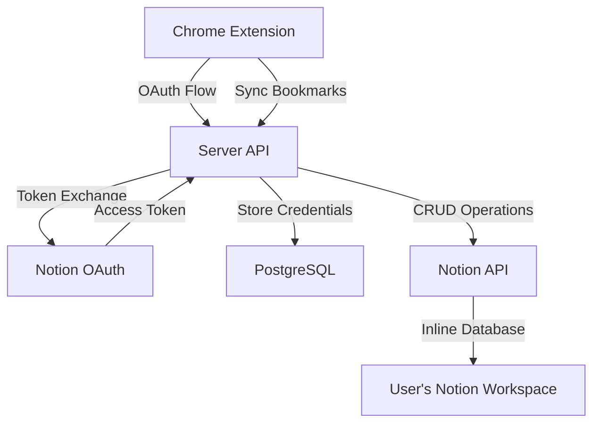
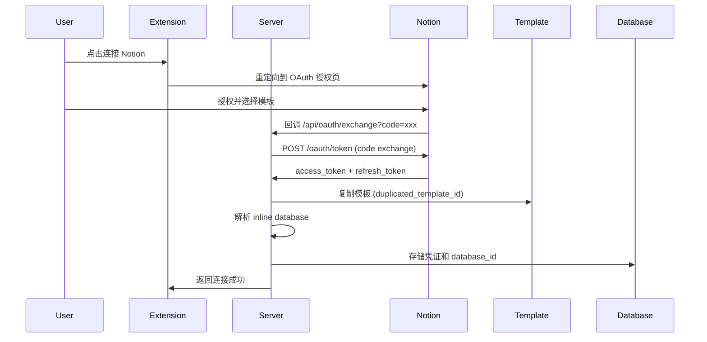
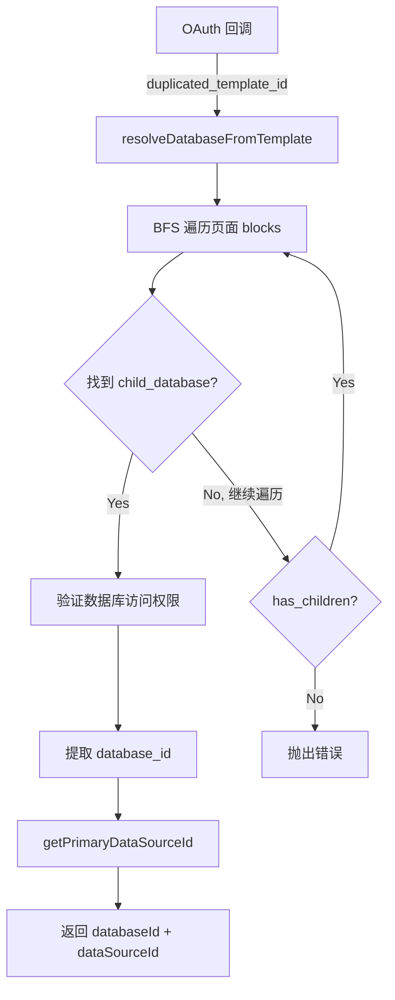
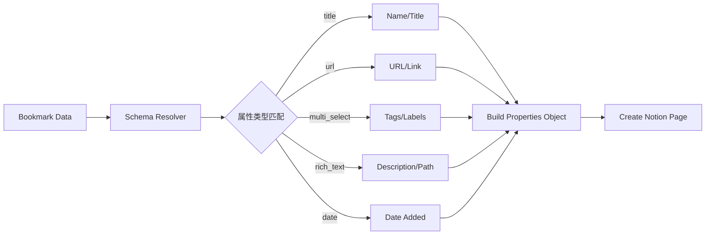
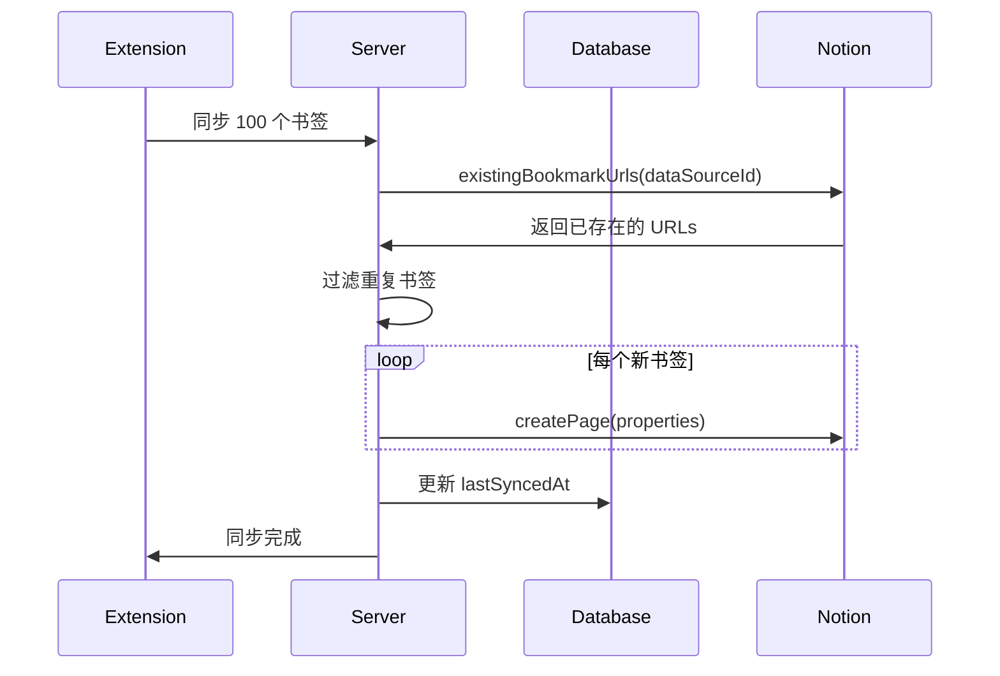

# Notion Integration Architecture

## 1. 系统架构概览



### 核心组件

- **Chrome Extension**: 用户界面，管理书签同步
- **Server API**: 中间层，处理认证和数据转换
- **Notion Integration**: OAuth 应用，访问用户 workspace
- **Database**: 存储用户凭证和同步状态

---

## 2. OAuth 认证流程



### 关键步骤

#### 2.1 授权初始化

```typescript
// Extension triggers OAuth
const authUrl = `https://api.notion.com/v1/oauth/authorize?
  client_id=${CLIENT_ID}&
  redirect_uri=${REDIRECT_URI}&
  response_type=code&
  owner=user&
  template_pages=${TEMPLATE_ID}`;
```

#### 2.2 Token Exchange

```typescript
// Server exchanges code for tokens
exchangeOAuthCode(code, redirectUri) {
  return fetch('https://api.notion.com/v1/oauth/token', {
    method: 'POST',
    headers: { Authorization: `Basic ${base64(clientId:secret)}` },
    body: { grant_type: 'authorization_code', code, redirect_uri }
  });
}
```

#### 2.3 Token Refresh

```typescript
// Refresh expired access token
refreshAccessToken(refreshToken) {
  return fetch('https://api.notion.com/v1/oauth/token', {
    method: 'POST',
    body: { grant_type: 'refresh_token', refresh_token }
  });
}
```

---

## 3. 模板系统设计

### 3.1 Inline Database 结构

当前系统使用 **页面内嵌数据库** (Inline Database) 架构：

```
📄 Bookmarks Page (duplicated_template_id)
  └── 🗃️ Inline Database (child_database block)
       ├── Name (title)
       ├── URL (url)
       ├── Tags (multi_select)
       ├── Description (rich_text)
       ├── Path (rich_text)
       ├── Date Added (date)
       └── Sync ID (rich_text)
```

### 3.2 模板解析流程



### 3.3 核心设计原则

**Inline Database 的关键特性**:

- `database_id` = `data_source_id` (身份统一)
- 通过 `child_database` block 嵌入页面
- 不需要 `dataSources.retrieve()` API
- 直接使用 `databases/{id}` endpoint

---

## 4. 数据同步架构

### 4.1 Schema 自适应映射



### 4.2 属性智能匹配

```typescript
// 按类型和命名模式匹配
const byTypeNamed = (type: string, regex: RegExp) =>
  entries.find(([k, v]) =>
    v?.type === type && regex.test(k.toLowerCase())
  )?.[0];

// 匹配策略优先级
1. 类型 + 名称模式 (e.g., multi_select + /tag|label/)
2. 仅类型匹配 (e.g., title)
3. Fallback 默认值 (e.g., "Name")
```

### 4.3 去重机制



---

## 5. API 交互层

### 5.1 核心方法职责

| 方法                            | 用途               | Notion API             |
| ------------------------------- | ------------------ | ---------------------- |
| `getPrimaryDataSourceId`        | 获取数据源 ID      | 直接返回 database_id   |
| `resolveDatabaseFromTemplate`   | 解析模板中的数据库 | `blocks.children.list` |
| `buildPropertiesFromDataSource` | 构建属性对象       | `databases/{id}`       |
| `existingBookmarkUrls`          | 查询已存在书签     | `dataSources.query`    |
| `createPage`                    | 创建书签页面       | `pages.create`         |
| `updatePage`                    | 更新书签页面       | `pages.update`         |

### 5.2 错误处理策略

```typescript
// 三层降级策略
try {
  // 1. 标准路径
  return await primaryMethod();
} catch (error) {
  // 2. 降级方案
  console.warn('Fallback to alternative');
  return await fallbackMethod();
} finally {
  // 3. 默认值
  return defaultValue;
}
```

---

## 6. 关键设计决策

### 6.1 为什么选择 Inline Database?

| 对比项       | Full-page Database | Inline Database              |
| ------------ | ------------------ | ---------------------------- |
| 用户体验     | 数据库独立页面     | 数据库嵌入页面               |
| 结构复杂度   | 简单               | 需要 BFS 遍历                |
| API 兼容性   | data_sources 数组  | database_id = data_source_id |
| 模板复制     | 返回 database_id   | 返回 page_id                 |
| **选择理由** | ❌ 页面分散        | ✅ 集中管理，UX 更好         |

### 6.2 BFS 遍历设计

```typescript
// 深度优先搜索 child_database blocks
const queue = [templatePageId];
const visited = new Set();
const maxDepth = 4;

while (queue.length) {
  const blockId = queue.shift();
  const children = await notion.blocks.children.list({ block_id: blockId });

  for (const block of children.results) {
    if (block.type === 'child_database') {
      return { databaseId: block.id, dataSourceId: block.id };
    }
    if (block.has_children) {
      queue.push(block.id);
    }
  }
}
```

**设计考量**:

- 限制深度为 4 层防止无限循环
- 使用 visited Set 避免重复遍历
- 支持嵌套结构 (toggle, callout)

### 6.3 Schema-less 属性映射

```typescript
// 灵活适配不同数据库 schema
const properties = {
  [titleProp]: { title: [{ text: { content: bookmark.title } }] },
  [urlProp]: { url: bookmark.url },
  [tagsProp]: { multi_select: bookmark.tags.map((t) => ({ name: t })) },
  // ... 动态匹配其他属性
};
```

**优势**:

- 用户可自定义属性名称
- 自动匹配类型和命名模式
- 降级到默认属性名 ("Name", "URL")

---

## 7. 安全与性能

### 7.1 认证安全

```typescript
// Token 加密存储
{
  notionUserId: string,           // Notion user UUID
  accessToken: string,            // 加密存储
  refreshToken: string,           // 加密存储
  accessTokenExpiresAt: Date,
  workspaceId: string,
  databaseId: string
}
```

### 7.2 API 限流策略

```typescript
// 15s 超时 + AbortController
const controller = new AbortController();
const timeout = setTimeout(() => controller.abort(), 15000);

await fetch(url, { signal: controller.signal });
```

### 7.3 分页查询

```typescript
// 自动处理 Notion API 分页
let cursor = undefined;
do {
  const response = await notion.dataSources.query({
    data_source_id: id,
    start_cursor: cursor,
    page_size: 100,
  });
  cursor = response.next_cursor;
} while (cursor);
```

---

## 8. 未来优化方向

### 8.1 性能优化

- 数据库 ID 缓存 (避免重复解析)
- 批量操作 API (减少网络请求)
- WebSocket 实时同步

### 8.2 功能扩展

- 支持多数据库同步
- 双向同步 (Notion → Browser)
- 冲突解决策略

### 8.3 用户体验

- 国际化 (Q1 2025)
- 同步进度可视化
- 错误恢复机制
