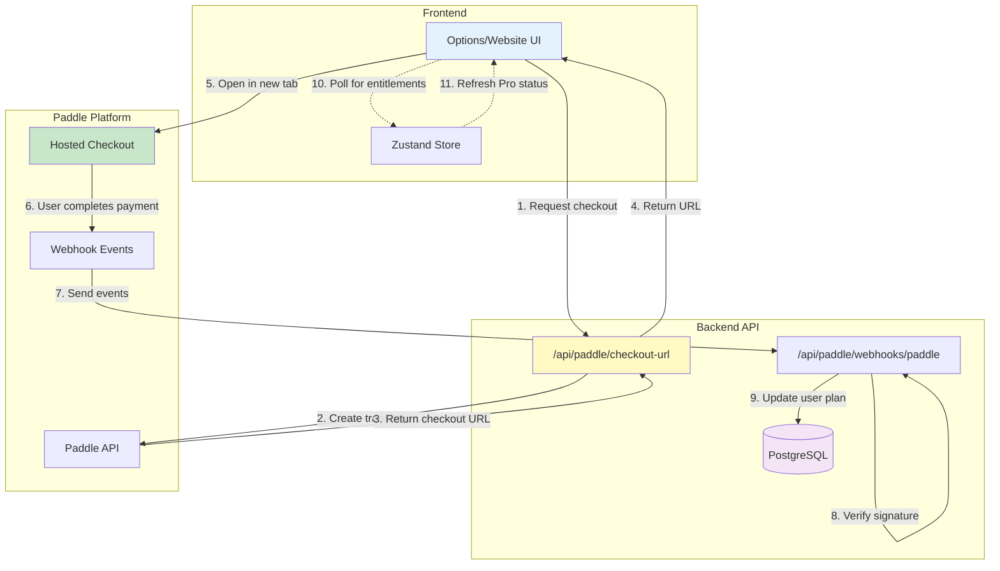
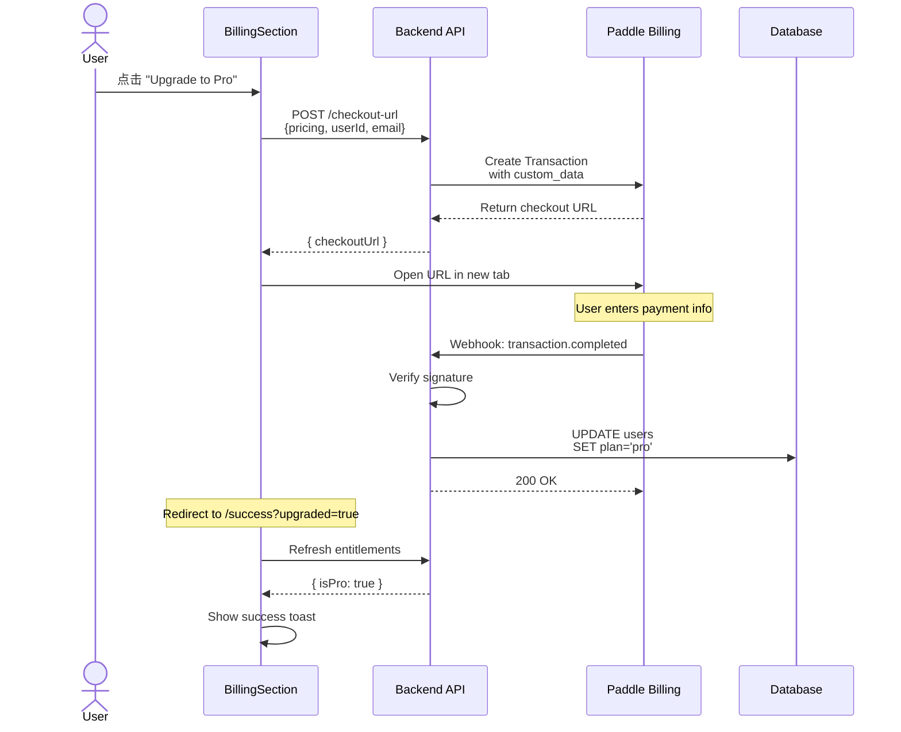
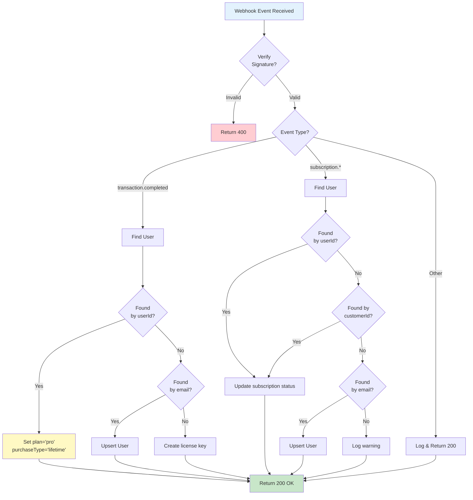
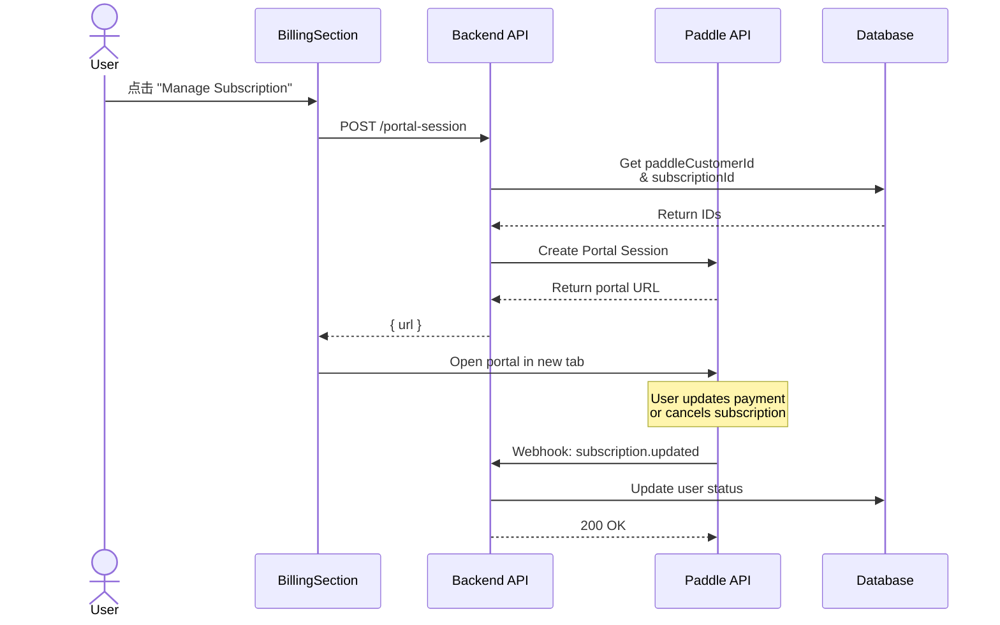
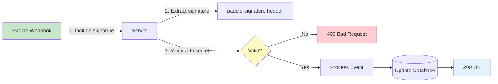

# Paddle Payment Integration

> **Pro 订阅支付集成 - 使用 Paddle Billing 平台**

> **注意：** Website 仅展示价格信息，升级流程仅在 Chrome 扩展内进行。

## 📐 设计原则

1. **Extension-First Checkout** - 扩展直接打开 Paddle 托管结账页
2. **服务端验证** - Webhook 验证签名，确保安全
3. **灵活升级路径** - 支持月付和终身买断
4. **用户友好对账** - 通过 userId 和 email 双重匹配
5. **Website 简化** - 网站只展示价格，不处理支付

---

## 🏗 架构设计

### 支付流程架构



---

## 💳 定价方案

### 当前价格

| 方案         | 价格          | 特点                   |
| ------------ | ------------- | ---------------------- |
| **Monthly**  | $2.50/月      | 按月付费，随时取消     |
| **Lifetime** | $30 一次性    | 永久访问，包含未来更新 |

### 功能对比

| 功能     | Free          | Pro ($2.50/月) |
| -------- | ------------- | -------------- |
| 手动同步 | ✅ 不限书签数量 | ✅ 不限书签数量 |
| 自动同步 | ❌            | ✅ 6小时最小间隔 |
| 智能去重 | ❌            | ✅ 指纹识别      |
| AI 标签  | ❌            | 规划中           |
| AI 摘要  | ❌            | 规划中           |
| 支持     | 社区          | 优先响应         |

---

## 🔄 核心流程

### 1. 购买流程（Extension）



### 2. Webhook 处理逻辑



### 3. 订阅管理（Monthly Only）



---

## 🔧 技术实现

### Extension: paddle.ts

**核心函数**:

```typescript
openPaddleCheckout({
  pricing: 'monthly' | 'lifetime',
  userId: string,
  userEmail?: string,
  successUrl: string
})
```

**实现策略**:

- ❌ 不使用 `@paddle/paddle-js`（CDN 资源违反 CSP）
- ✅ 服务端生成 checkout URL，前端打开新标签页
- ✅ 通过 `custom_data` 传递 `userId` 进行用户匹配

### Server: paddle.ts Routes

| 端点                   | 方法 | 用途                 |
| ---------------------- | ---- | -------------------- |
| `/checkout-url`        | POST | 创建 Paddle 结账会话 |
| `/webhooks/paddle`     | POST | 处理 Paddle 事件回调 |
| `/portal-session`      | POST | 生成订阅管理门户链接 |
| `/cancel-subscription` | POST | 取消月付订阅         |
| `/subscription-info`   | GET  | 获取订阅详情         |

### Webhook 事件处理

**监听事件**:

- `transaction.completed` - 终身购买完成
- `subscription.created` - 月付订阅创建
- `subscription.activated` - 订阅激活
- `subscription.updated` - 订阅更新
- `subscription.canceled` - 订阅取消
- `subscription.past_due` - 支付逾期
- `subscription.paused` - 订阅暂停

**匹配优先级**:

1. **customData.userId** - 扩展传递的内部用户 ID（CUID）
2. **paddleCustomerId** - Paddle Customer ID（用于续费/取消）
3. **email** - 邮箱匹配（Fallback，用于 upsert）

### 安全机制



**保护措施**:

- ✅ Webhook 签名验证（`paddle-signature` header）
- ✅ API Key 仅服务端存储
- ✅ Client Token 安全（浏览器端可用）
- ✅ Custom Data 传递 userId 避免依赖 email

---

## 🧪 测试配置

### 环境变量

**Server** (`packages/server/.env`):

```bash
# Paddle API
PADDLE_API_KEY=test_xxxxx
PADDLE_ENVIRONMENT=sandbox
PADDLE_WEBHOOK_SECRET=<paddle-webhook-secret>
PADDLE_PRO_MONTHLY_PRICE_ID=pri_xxxxx
PADDLE_PRO_LIFETIME_PRICE_ID=pri_xxxxx

# Pricing Fallback
PRICE_MONTHLY_USD=2.99
PRICE_LIFETIME_USD=29.99
```

**Extension** (`packages/extension/.env`):

```bash
VITE_PADDLE_CLIENT_TOKEN=test_xxxxx
VITE_PADDLE_ENVIRONMENT=sandbox
VITE_OAUTH_SERVER_URL=http://localhost:3000
VITE_WEBSITE_URL=http://localhost:3001
```

### 快速测试

**1. 设置 Paddle Sandbox**:

- 注册: https://sandbox-login.paddle.com/signup
- 创建产品 "Bookmark Sync Pro"
- 创建 Monthly 和 Lifetime 价格
- 复制 Price ID 到 `.env`

**2. 配置 Webhook**:

```bash
# 启动服务
pnpm dev:server

# 启动 ngrok
ngrok http 3000

# Paddle Dashboard 添加 Webhook:
# URL: https://your-ngrok.ngrok.io/api/paddle/webhooks/paddle
# Events: All transaction & subscription events
```

**3. 测试购买流程**:

```bash
# 加载扩展
pnpm build:extension

# 在 Chrome 中:
1. 连接 Notion
2. 进入 Billing 页面
3. 点击 "Upgrade to Pro"
4. 使用测试卡: 4242 4242 4242 4242
5. 完成支付
6. 检查 webhook logs
7. 刷新 Options 页面，验证 Pro 状态
```

### 测试卡号

| 卡号                | 场景           | 结果        |
| ------------------- | -------------- | ----------- |
| 4242 4242 4242 4242 | 正常支付       | ✅ 成功     |
| 4000 0000 0000 0002 | 卡被拒绝       | ❌ 失败     |
| 4000 0025 0000 3155 | 需要 3D Secure | 🔐 需要验证 |

### 验证 Webhook

**检查日志**:

```bash
# Server logs
🎫 Creating Paddle checkout URL...
✅ Checkout URL created: https://...
📥 Webhook: transaction.completed
✅ Updated user xxx to pro via webhook
```

**验证数据库**:

```sql
SELECT id, email, plan, purchase_type, paddle_customer_id
FROM users
WHERE plan = 'pro';
```

---

## 📊 状态管理

### Database Schema

```typescript
User {
  id: string (CUID)
  email: string
  plan: 'free' | 'pro'
  purchaseType?: 'monthly' | 'lifetime'
  paddleCustomerId?: string
  paddleSubscriptionId?: string
  licenseKey?: string
}
```

### Extension Storage

```typescript
ChromeLocalCache {
  is_pro: boolean
  purchase_type?: 'monthly' | 'lifetime'
  user_id: string
  user_email: string
}
```

---

## 🔗 相关文档

- [Paddle Developer Docs](https://developer.paddle.com/)
- [Paddle Sandbox Dashboard](https://sandbox-vendors.paddle.com/)
- [Testing Payment Methods](https://developer.paddle.com/concepts/payment-methods/credit-debit-card)
- [Webhook Events Reference](https://developer.paddle.com/webhooks/overview)
- [Testing Checklist](../TESTING_CHECKLIST.md)
