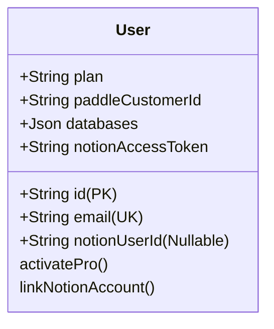
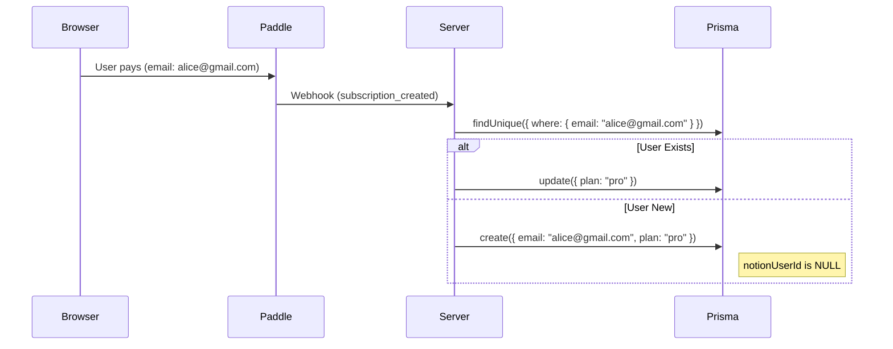
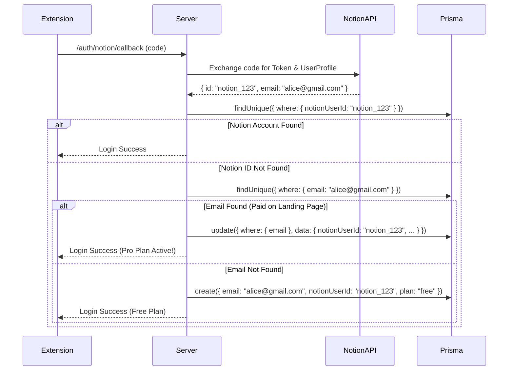

# Technical Specification: User System & Payment Reconciliation

## 1. Context

- **Stack:** Node.js, Express, Prisma.
- **Frontend:** React (Extension), Next.js (Landing Page).
- **Payment:** Paddle.
- **Problem:** Need to support independent payments (via Landing Page) and Notion-linked usage. Users must be reconcilable via **Email**.

## 2. Database Schema (Prisma)

**Instruction for Copilot:**

> Update the `schema.prisma` file.
> We are migrating from a strictly Notion-ID-based system to an internal UUID system.
> Please merge the user's existing `UserData` fields into this new model.

```prisma
model User {
  // --- 1. Identity (Internal System) ---
  id            String   @id @default(cuid()) // Use CUID or UUID
  email         String   @unique              // The glue for reconciliation (from Paddle or Notion)
  createdAt     DateTime @default(now())
  updatedAt     DateTime @updatedAt

  // --- 2. Payment Status (Paddle) ---
  plan             String   @default("free") // "free", "pro"
  paddleCustomerId String?  @unique
  licenseKey       String?  // Fallback for manual activation if emails differ

  // --- 3. Notion Identity (Linked via OAuth) ---
  // Formerly "userId", now explicit to allow NULL (before connection)
  notionUserId      String?  @unique
  notionAccessToken String?
  notionRefreshToken String?
  notionWorkspaceId String?

  // --- 4. App Configuration (Your UserData fields) ---
  // These are optional because a user might pay before installing the extension
  databases            Json?    // Storing any[] as Json
  templateDatabaseId   String?
  notionDatabaseId     String?
  notionDataSourceId   String?
  botId                String?
  duplicatedTemplateId String?
  lastActivity         DateTime @default(now())

  @@index([email])
  @@index([notionUserId])
}
```

---

## 3. Architecture Diagrams

### A. Entity Relationship



### B. Critical User Flows

#### Flow 1: Landing Page Purchase (Anonymous -> Pro)



#### Flow 2: Extension Activation (Reconciliation)



---

## 4. Implementation Logic (Node/Express)

**Instruction for Copilot:**

> Implement the controller logic for these two scenarios using the updated Prisma schema.

### A. Paddle Webhook Handler

`POST /api/webhooks/paddle`

**Logic:**

1.  Verify Paddle signature.
2.  Extract `email` and `passthrough` from the body.
3.  **Passthrough Check:** If `passthrough.internalUserId` exists, update that user directly.
4.  **Email Check:** If no passthrough, `prisma.user.upsert`:
    - **Create:** `{ email: payload.email, plan: 'pro', licenseKey: generateKey() }`
    - **Update:** `{ plan: 'pro' }`

### B. Notion Auth Controller

`POST /api/auth/notion` (or your callback route)

**Logic:**

1.  Get Notion Token & User Info from Notion API.
    - `const notionEmail = notionUser.person.email;`
    - `const notionUid = notionUser.id;`
2.  **Step 1: Try Login via Notion ID**
    - `const existingUser = await prisma.user.findUnique({ where: { notionUserId: notionUid } })`
    - If found -> Update `lastActivity` and tokens -> Return JWT.
3.  **Step 2: Try Reconciliation via Email** (If Step 1 failed)
    - `const paidUser = await prisma.user.findUnique({ where: { email: notionEmail } })`
    - If found -> **MERGE**:
      - `await prisma.user.update({ where: { id: paidUser.id }, data: { notionUserId: notionUid, notionAccessToken: ... } })`
    - If not found -> **CREATE NEW**:
      - `await prisma.user.create({ data: { email: notionEmail, notionUserId: notionUid, plan: 'free', ... } })`

### C. Manual License Restore (API)

`POST /api/user/restore-purchase`

**Logic:**

- **Input:** `targetEmail` (The email they used on Paddle).
- **Context:** User is currently logged in (we have `req.user.id`).
- **Action:**
  1.  Find the "Ghost" record: `const ghost = await prisma.user.findUnique({ where: { email: targetEmail } })`
  2.  Validate `ghost.plan === 'pro'` and `ghost.notionUserId === null`.
  3.  **Merge Strategy:**
      - Update current user: `plan = 'pro'`, `paddleCustomerId = ghost.paddleCustomerId`.
      - Delete (or archive) the ghost record to prevent double use.

---

## 5. Copilot Prompts (直接复制进对话框)

你可以分两步将任务派发给 Copilot：

**Step 1: Update Prisma Schema**

> "Here is my current data structure interface `UserData`. I need to switch to a robust User management system that supports Paddle payments and Notion OAuth. Please update my `schema.prisma` based on the 'Database Schema' section of this spec. Make sure to map my old `userId` to `notionUserId` and make specific fields optional."

**Step 2: Implement Business Logic**

> "Now, strictly following the logic defined in '4. Implementation Logic', please write the Express controller functions for:
>
> 1. `handlePaddleWebhook` (handling subscription_created/updated events).
> 2. `handleNotionCallback` (handling the OAuth exchange and the user reconciliation/merge logic).
>
> Assume I am using Prisma Client (`prisma`)."

### 关键注意点

1.  **邮箱是关键**：Notion 返回的 API 数据中，`user.person.email` 是你连接“落地页付费”和“插件使用”的唯一桥梁。
2.  **Prisma 迁移**：如果你已经有线上数据，运行 `prisma migrate` 时要注意，因为原本的 schema 结构变了（添加了 email 为 unique）。你需要写一个简单的脚本，把现有的 `userId` 迁移到 `notionUserId`，并如果可能的话，回填一下 email（或者暂时允许 email 为空，等到用户下次登录时补全）。
