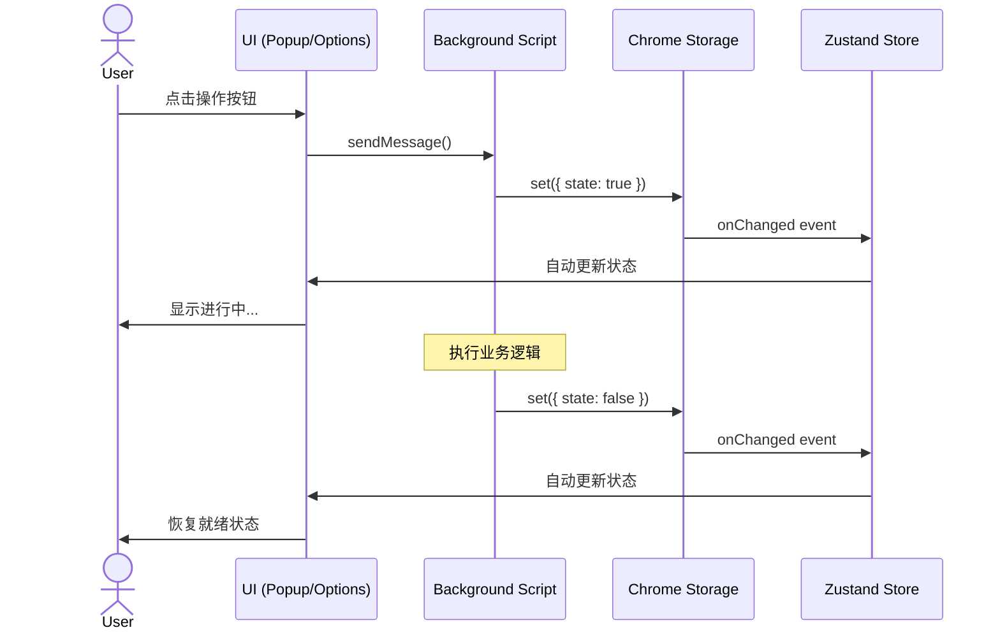
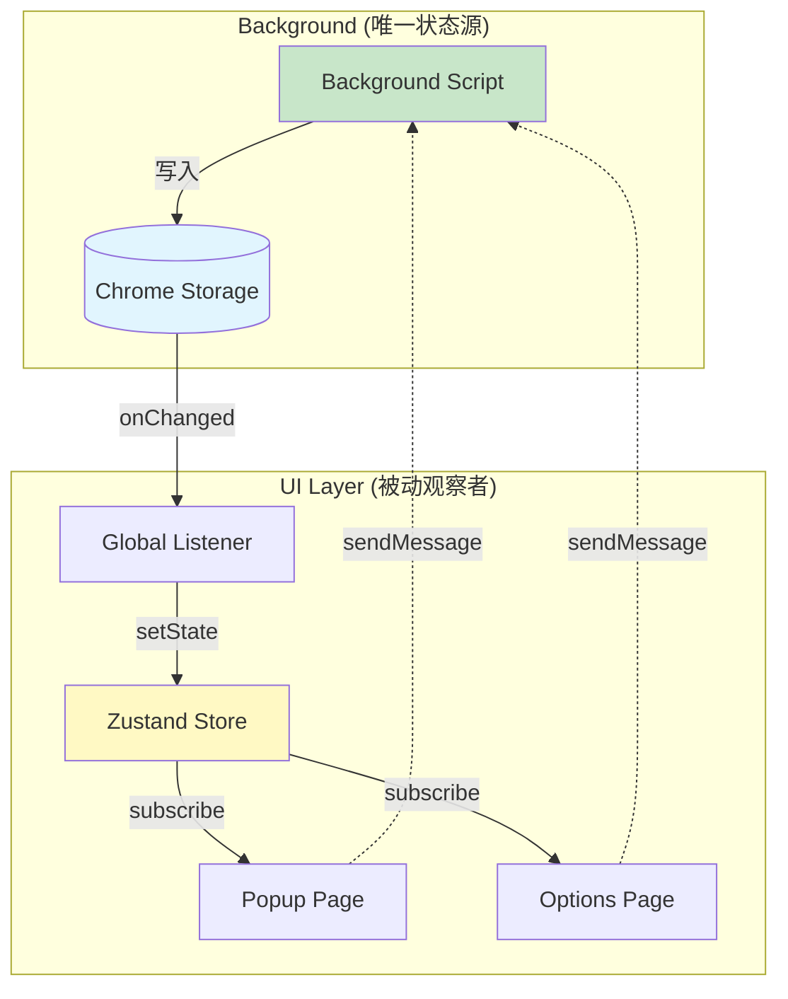

# State Management Architecture

> **单一数据源架构 - 确保 Popup 和 Options 页面状态完美同步**

## 📐 设计原则

### 单一数据源 (Single Source of Truth)

1. **Background Script** - 状态的唯一写入者
2. **Chrome Storage** - 状态总线，持久化存储
3. **Zustand Store** - 通过全局监听器自动同步状态
4. **UI 组件** - 只读取状态，通过消息触发操作

## 🔄 状态流转

### 状态同步时序图

### 系统架构图

---

## 🎯 核心机制

### 1. 状态写入机制

**Background Script 统一管理**

- 所有状态变更都通过 `chrome.storage.local.set()` 写入
- 确保状态的原子性和一致性
- 自动持久化，页面刷新不丢失

### 2. 状态同步机制

**Global Storage Listener**

- 在 `AppProvider` 中设置唯一的全局监听器
- 监听 `chrome.storage.onChanged` 事件
- 自动将 storage 变化同步到 Zustand store

### 3. UI 响应机制

**React 组件订阅 Zustand**

- 通过 `useAppStore()` 读取状态
- 状态变化自动触发组件重渲染
- 无需手动管理本地状态

## 📊 关键状态

| 状态键             | 管理位置          | 用途             | 更新时机        |
| ------------------ | ----------------- | ---------------- | --------------- |
| `sync_in_progress` | Background Script | 同步进行中标志   | 同步开始/结束   |
| `is_connecting`    | Background Script | OAuth 连接中标志 | OAuth 开始/完成 |
| `session_token`    | OAuth / Logout    | 认证令牌         | 登录/登出       |
| `is_pro`           | Server API        | Pro 权限标志     | 支付成功/刷新   |
| `purchase_type`    | Server API        | 购买类型         | 支付成功        |
| `last_sync`        | Background Script | 上次同步时间     | 同步完成        |

## ✅ 最佳实践

### DO ✅

1. **Background 管理状态** - 所有状态变更在 background script 中完成
2. **单一 Listener** - 只在 AppProvider 设置一个全局监听器
3. **UI 只读** - UI 组件通过 `sendMessage()` 触发操作，不直接修改状态
4. **自动同步** - 依赖 storage listener 自动更新，不手动调用 `setState`

### DON'T ❌

1. **不要在 UI 中写状态** - 避免 `setIsSyncing(true/false)`
2. **不要多个监听器** - 避免在多处设置 storage listener
3. **不要本地状态** - 避免 `useState` 管理全局共享状态
4. **不要 finally 清除** - 避免在 try/finally 中强制清除状态标志

## 🐛 常见问题

| 问题                        | 原因                       | 解决方案                        |
| --------------------------- | -------------------------- | ------------------------------- |
| 按钮卡在 loading 状态       | UI 在 finally 中清除了状态 | 移除 finally 中的 setState 调用 |
| Popup 和 Options 状态不同步 | 各自有独立的 listener      | 使用单一全局 listener           |
| 刷新后状态丢失              | 使用了 useState 本地状态   | 从 storage 加载初始状态         |
| OAuth 完成后状态未更新      | 未设置 connecting 开始标志 | 在 OAuth 开始时设置状态         |

## 📚 技术栈

- **Chrome Storage API** - 跨页面状态持久化
- **Zustand** - React 状态管理
- **Chrome Messaging** - Background 与 UI 通信
- **Mermaid** - 流程图语法（GitHub/VS Code 原生支持）

## 🎯 核心优势

- ✅ **状态一致性** - 所有页面实时同步
- ✅ **自动持久化** - 关闭页面不丢失状态
- ✅ **无竞态条件** - 单一写入源
- ✅ **代码简洁** - UI 逻辑清晰，职责分明
